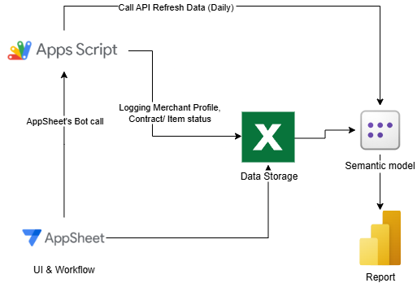
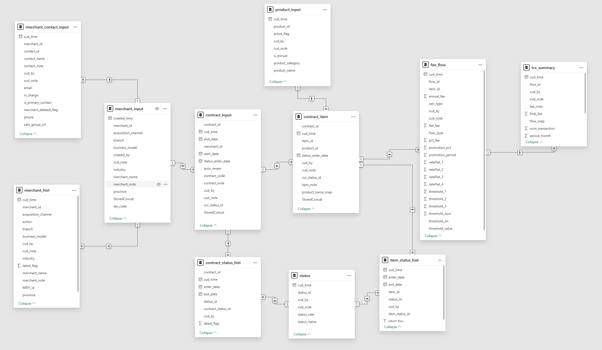
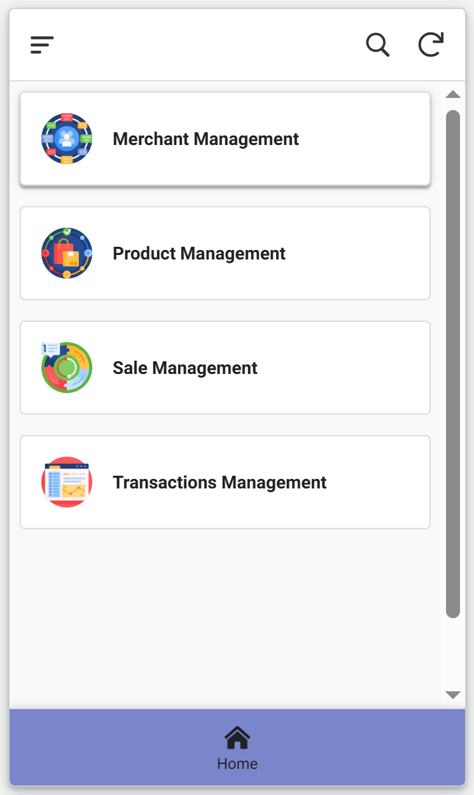
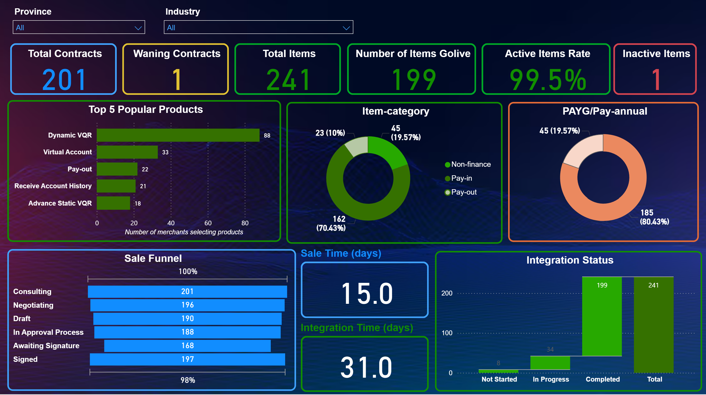

# Merchant_Management_System - AppSheet + Appscript + Google Sheets + Power BI

## 🌟 Overview
This project is a lightweight Baas Merchant Management System built with **AppSheet** (for UI), **Google Sheets** (as database), and **Power BI** (for analytics).  
This low-code system supports merchant management, contract tracking, integration process tracking, fee and transaction management, daily reporting.

## 🏗️ Architecture and Integration
- **Google Sheets**: Data Storage
- **AppSheet**: UI & Workflow
- **Apps Script**: Logging, Refeshing data
- **Power BI**: Dashboard visualize data

## 🗄️ Data Model

## 🔑 Features
- Merchant Management:
  + Merchant Profile: Create, Update, Delete Merchant's information (Name, Tax code, Industry,..)
  + Merchant Contact: Create, Update, Delete Merchant's contact (Name, Title, Phone number,...)
- Product Management: View product list (only admin can update, delete product)
- Sale Management:
  + Contract Management: Create, Update, Cancel Merchant's Contract.
  + Intergration Magagement: Insert product into contract (item), Update, Cancel Item.
  + Fee Management: Create, Update, Delete pricing rules for each Item.
- Transaction Summary: Create, Update, Delete transaction data of items used by merchants (by each fee flow)
- Power BI Interactive Dashboard (filter, drill-down)

## 📊 Demo
- [AppSheet App (Contact me to request using acces)](https://www.appsheet.com/start/bf06e440-b045-48a5-be6c-f4ca4646396b)
- [Google Sheets (Sample Data)](https://docs.google.com/spreadsheets/d/13bX1hj0oGoyBWHq_LEIQ0CaoqSpPEHw0tGiQJOYRM9s)
- [Power BI Report (Public Link)](https://app.fabric.microsoft.com/view?r=eyJrIjoiYTQzMDMxODMtYjFiMy00M2U1LTllZTUtY2JkMzc3ZDY4NzUzIiwidCI6IjhkMzg0MzBjLWIzOGQtNDg2Yy1iYmU1LTM3YzY0NTc5ZDcwZiIsImMiOjEwfQ%3D%3D)

## 📷 Screenshots
| AppSheet | Power BI |
|----------|-----------|
|  |  |

## ⚙️ How It Works
1. **Data Input:** Users enter/update data via AppSheet.
2. **Data Storage:** Google Sheets stores raw inputs and logs.
3. **Data Analytics:** Power BI consumes data from Google Sheets for reporting.
4. **User Experience:** Business users interact with AppSheet for operations and Power BI for analytics.

## AppScript:
- [Writelog_Merchant](https://script.google.com/d/1EduCoNwT1hIg_ynMM6afyMaZrRE9hDE0_0a1Kznve7CnigF3CeewCsU6)
  + logMerchantChange(): Call this function when merchant_input table add, update record
  + logMerchantDeleted(): Call this function when merchant_input table delete record
- [tagDeletedContacts](https://script.google.com/d/1OqUkrP3-H93WctVOKNGmz3f8akPv_w8p9bxZiM14L0mfJJswAfH5HBsP)
  + tagDeletedContacts(): Call this function when merchant_input table delete record
- [Write_contractStatus_Hist](https://script.google.com/d/1NA6tRli3SmqWU_HRvfinETTYPiC-6BDI0TQV8r0Sk0e2BTOc7tRquz7o)
  + write_contractStatus_Hist(): Call this function when contract_input table add, update record with value in column [cur_status_id] changed.
- [Write_itemStatus_Hist](https://script.google.com/d/1B7ELDK4Y6ONAuXmlNAi0EOX-CT55Hmp_5N5UPk1FZe7sPOZ5nvYknGPW)
  + Write_itemStatus_Hist(): Call this function when item_input table add, update record with value in [cur_status_id] changed.
- Power BI data refresh funtion: Embeded in the appscript file, which belong to the Sheets above.
